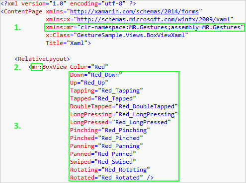

## Code Samples
{: #CodeSamples }

All the elements which are usually in the `Xamarin.Forms` namespace can also be found in `MR.Gestures`.
But those have additional event handlers and command properties.

Adding the event handlers works the same way as in standard Xamarin Forms or WPF controls in both XAML and code.

### Event Handlers in XAML
{: #EventsXAML }

To add the event handler in XAML you have to:

1.  Add the namespace MR.Gestures from the dll
2.  Use the element from that namespace instead of Xamarin.Forms
3.  Add the handlers for the gestures you want to listen to

Here on `LongPressed` the method `Red_LongPressed` should be called. The method must be defined in the code behind file like this

~~~~ cs
    void Red_LongPressed(object sender, MR.Gestures.LongPressEventArgs e)
    {
        Console.WriteLine("BoxViewXaml.Red_LongPressed method called");
    }
~~~~

### Event Handlers in Code
{: #EventsCode }

Of course you can do the same in code. Either with a lambda expression

~~~~ cs
    var box1 = new MR.Gestures.BoxView { Color = Color.Red };
    box1.LongPressed += (s, e) => Console.WriteLine("Code: Red LongPressed");
~~~~

or by assigning the method as a handler.

~~~~ cs
    box1.LongPressed += Red_LongPressed;
~~~~

### Commands in XAML
{: #CommandsXAML }

But IMHO if you really want to separate the view from any code, then the view should be in XAML.
So instead of the event handlers you can also use commands in your view model and bind them to the respective properties.

~~~~ xml
    <mr:BoxView Color="Green"
        LongPressedCommand="{Binding LongPressedCommand}"
        LongPressedCommandParameter="Green" />
~~~~

The properties for the commands are called like the events, just with `Command` appended. You can also define a parameter passed to the command with the `*CommandParameter` properties. If you suppress the `CommandParameter`, then the respective event args are passed to your command. In this case a `MR.Gestures.LongPressEventArgs` object.

For the `Tapped`, `DoubleTapped` and `LongPressed` events you may not need the event args and defining a `CommandParameter` could make sense. But for the more complicated events you will always need the event args or you won't know what happened. E.g. it does not help to just know that an element has been swiped unless you also know in which direction. The `Direction` is contained in the `SwipeEventArgs`.

### Commands in Code
{: #CommandsCode }

You can bind the commands in code too.

~~~~ cs
    var box2 = new MR.Gestures.BoxView { Color = Color.Green };
    box2.SetBinding(MR.Gestures.BoxView.LongPressedCommandProperty, "LongPressedCommand");
    box2.LongPressedCommandParameter = "Green";
~~~~

* * *

The syntax for binding in code is a bit complicated, therefore my favorite is using commands in XAML. You will also see this, when you look through the code in the GestureSample. Although there are samples in all these categories, most of them are written in XAML and bound to commands.
